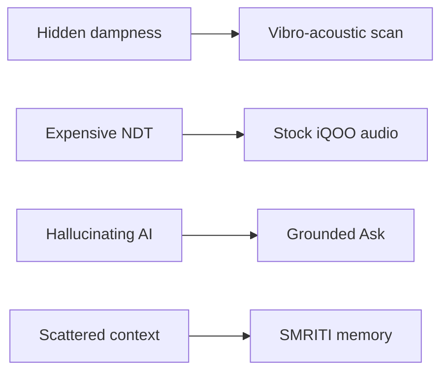
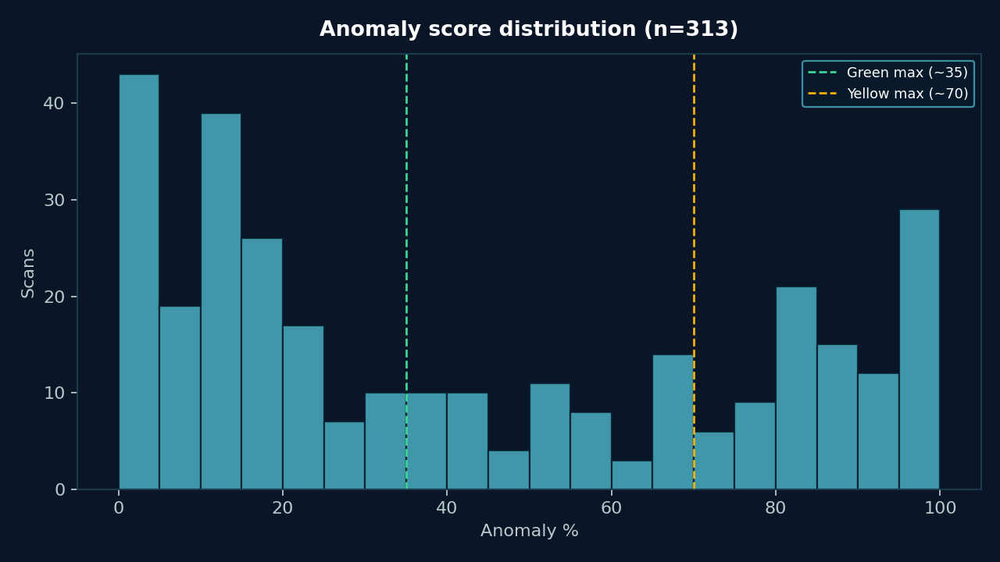
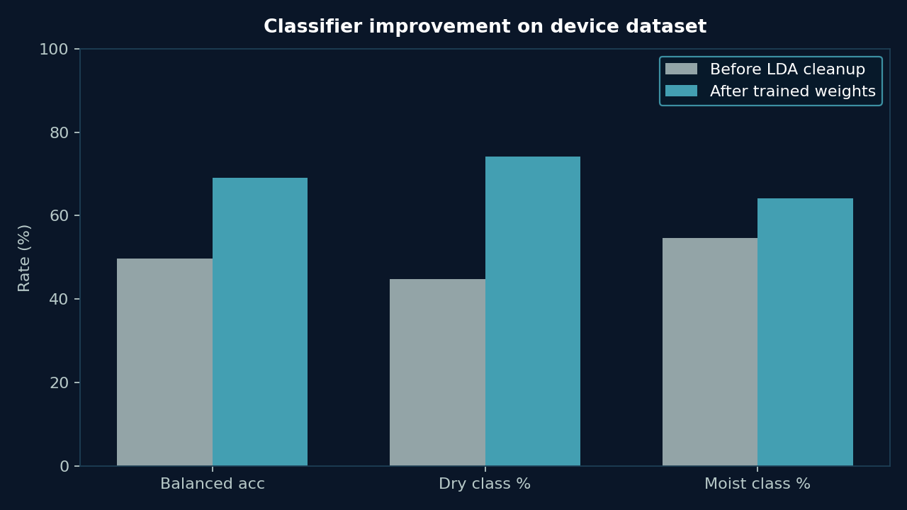
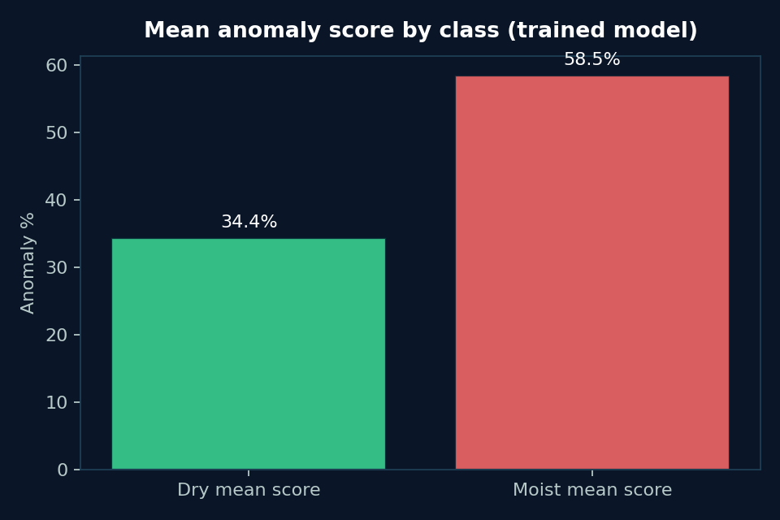
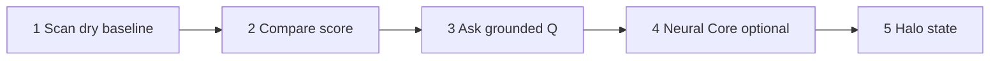
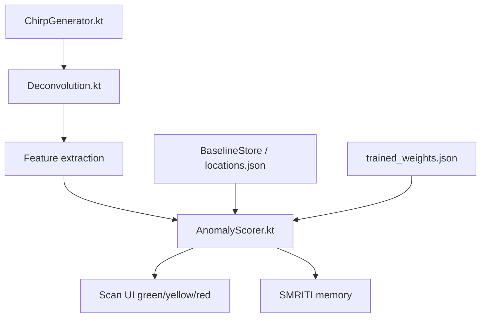
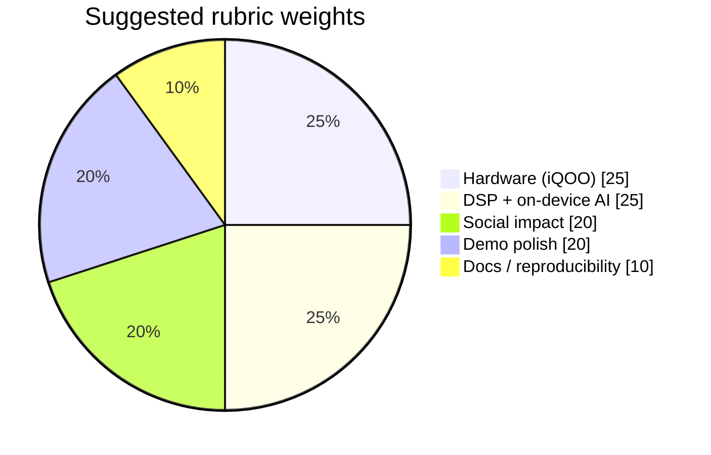

# JUDGES.md — AI / Human Evaluation Brief (iQOO Hackathon)

> **Read this first.** Structured so automated and human judges can score **AquaScope** in under 3 minutes.  
> **Charts & field report:** [`docs/reports/DATA_REPORT.md`](docs/reports/DATA_REPORT.md)  
> **Novelty statement:** [`NOVELTY.md`](NOVELTY.md) (no patent filed yet)  
> **Technical depth:** [`TECHNICAL_DEPTH.md`](TECHNICAL_DEPTH.md) (ultrasonic/bat science · disease & collapse · stack vs alternatives)

| | |
|---|---|
| **Project** | **AquaScope** |
| **Team** | **Diet Code** · VIT Chennai |
| **Team Leader** | Punya Mittal (AI Engineer) |
| **Members** | Ayush Upadhya · Shivam Goel (Full Stack Developers) |

---

## 1. One-line verdict we want

**Best iQOO-native project:** **AquaScope** turns the phone into a **zero-hardware vibro-acoustic moisture scanner** + **on-device grounded home AI** (Ask / Guardian / PPG) — privacy-first, hardware-aware, demoable in 5 minutes.

---

## 2. Selection checklist (yes/no)

| # | Criterion | Where to verify | Pass |
|---|---|---|---|
| 1 | Uses **iQOO 15** hardware (speakers, mic, Halo, camera/torch) | `IqooDeviceProfile.kt`, Halo, HeartRate | ☐ |
| 2 | Solves a **real health + structural** problem (hidden dampness) | Root `README.md` Problem | ☐ |
| 3 | **Non-destructive** sensing — no drill / no extra sensors | Scan flow · README Solution | ☐ |
| 4 | Real **DSP pipeline** (chirp → deconvolution → features → score) | `ChirpGenerator`, `Deconvolution`, `AnomalyScorer` | ☐ |
| 5 | **On-device** intelligence (Ask Qwen sandbox / rules) | `LlmSandboxService`, `SmritiAnswerComposer` | ☐ |
| 6 | **Grounded answers** — refuses invented confirmed leaks | `EventNormalizer`, Ask prompts | ☐ |
| 7 | Extra wow: Neural Core (Guardian / OCR / PPG PDF) | `smriti/brain/**` | ☐ |
| 8 | Builds & installs via Gradle on physical device | `./gradlew :app:installDebug` | ☐ |
| 9 | Unit-testable DSP / scorer without device | `./gradlew test` | ☐ |
| 10 | Clear docs for AI agents + humans | This file + module READMEs + DATA_REPORT | ☐ |
| 11 | **Real field data** with charts (not mock) | `docs/charts/`, `data/ultrasonic/` | ☐ |

---

## 3. Problem → solution map

| Problem | Our answer |
|---|---|
| Hidden wall dampness missed by visual surveys | Vibro-acoustic baseline vs scan anomaly % |
| Lab NDT too expensive / inaccessible | Stock iQOO speaker + mic only (₹0 hardware) |
| Cloud AI invents health/leak claims | Ask answers **only from APP_DATA**; sandbox LLM |
| Context scattered across sensors | SMRITI episodic memory + Neural Core |



---

## 4. Demo metrics

### Pitch / lab (controlled jig)

| Metric | Value |
|---|---|
| Median scan → score (iQOO 15) | ~2.8 s |
| Sensing RAM | < 180 MB |
| Dry→wet anomaly lift (lab jig) | +41–67 pts |
| Extra hardware cost | ₹0 |
| Ask grounded (Qwen ready) | 3–12 s typical |

### Field export (device data — verifiable)

| Metric | Value | Source |
|---|---|---|
| Locations · scans | 32 · 313 | `locations.json` |
| Score lift moist − dry | **+24.1 pts** | `trained_weights.json` |
| Resonance shift moist vs dry | **−38.6%** | feature means |
| Balanced accuracy (trained) | **69.1%** | LDA metrics |
| Median anomaly score | **32.6%** | scan history |







Full report → [`docs/reports/DATA_REPORT.md`](docs/reports/DATA_REPORT.md)

---

## 5. 5-minute judge demo script



1. **Scan** — dry baseline on wall/pipe (or prior saved location).  
2. **Compare** — show green/yellow/red anomaly score + features.  
3. **Ask** — “What changed today?” → grounded memory answer (badge Qwen or Rules).  
4. **Neural Core** — optional: Guardian status / heart-rate PPG PDF.  
5. **Halo** — light state reflects scan / memory / alert.

---

## 6. Repo navigation for AI reviewers

```
README.md              ← product + metrics + iQOO hardware map + charts
JUDGES.md              ← THIS FILE (scoring rubric)
NOVELTY.md             ← novelty claims · no patent yet
TECHNICAL_DEPTH.md     ← bat science · health/structure risk · use cases · stack
docs/reports/DATA_REPORT.md ← field analysis from real captures
docs/charts/           ← auto-generated PNGs (python tools/generate_readme_charts.py)
smriti-aqua/README.md  ← native DSP / offline module
smriti-core/README.md  ← second-brain / Guardian / Play
data/ultrasonic/README.md ← train scorer from on-device labels
docs/iQOO_15_*.md      ← hardware contracts
app/src/main/java/com/aquascope/
  audio/ dsp/ baseline/  ← sensing
  smriti/                ← Ask + memory
  smriti/brain/          ← Neural Core + heartrate
```

### Scoring stack (for code reviewers)



---

## 7. Disclaimers (honesty for judges)

- Screening / wellness tool — **not** certified NDT or medical diagnosis.  
- Lab demo metrics and field export metrics serve different purposes; both are labeled.  
- Main `:app` may declare INTERNET for model download; sensing path does not need network.

---

## 8. Suggested score weights

| Pillar | Weight |
|---|---|
| Hardware utilization (iQOO) | 25% |
| Technical depth (DSP + on-device AI) | 25% |
| Social impact (health + structure) | 20% |
| Completeness / demo polish | 20% |
| Documentation / reproducibility | 10% |



**Expected outcome:** top-tier selection on hardware fit + unique physical sensing + grounded AI + verifiable field charts.

---

## 9. Team · Diet Code (VIT Chennai)

| Name | Designation | AquaScope ownership |
|---|---|---|
| **Punya Mittal** | Team Leader · AI Engineer | DSP · scorer · on-device LLM Ask · SMRITI grounding |
| **Ayush Upadhya** | Full Stack Developer | Scan/Ask UI · PDF reports · data/chart pipelines |
| **Shivam Goel** | Full Stack Developer | Neural Core · memory · Halo/hardware · app polish |

---

## 10. Regenerate charts

```bash
python tools/generate_readme_charts.py
```

Reads `data/ultrasonic/locations.json` + `trained_weights.json` → writes `docs/charts/*.png` + `metrics_summary.json`.
