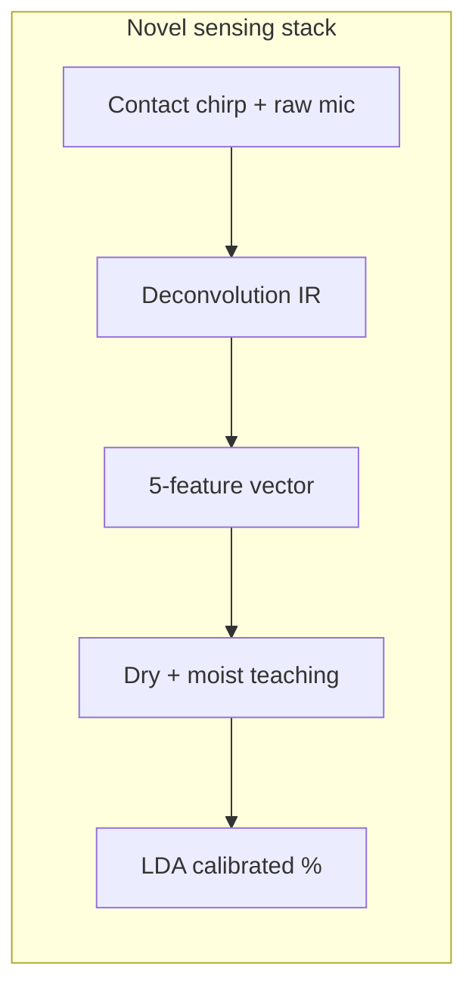
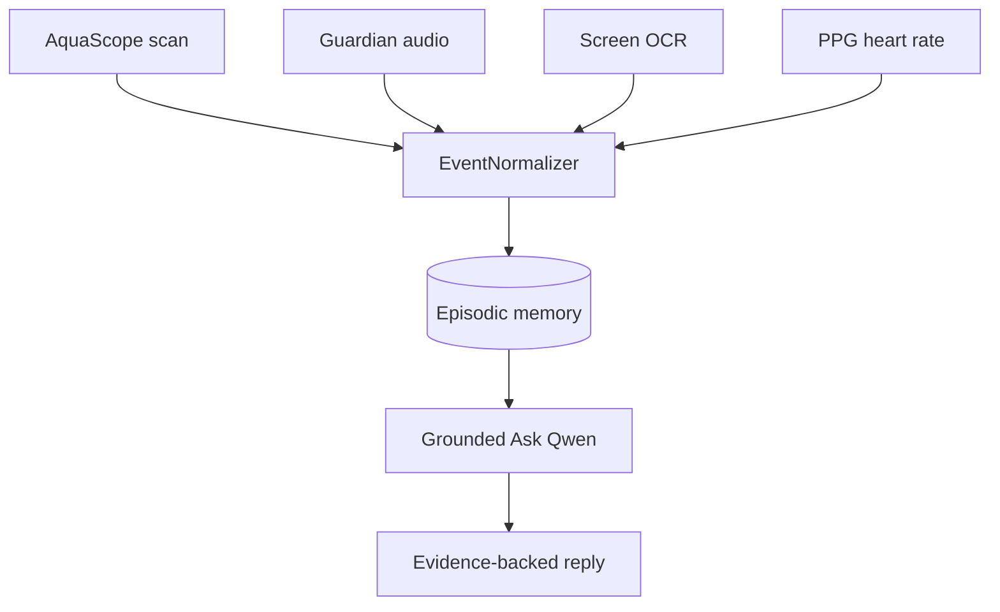

# NOVELTY.md — Technical Novelty Statement

> **Patent status:** No patent application has been filed as of September 2025.  
> This document records **original contributions** in SMRITI AQUA / AquaScope for hackathon evaluation, prior-art disclosure, and future IP planning.

**Related:** [`README.md`](README.md) · [`JUDGES.md`](JUDGES.md) · [`TECHNICAL_DEPTH.md`](TECHNICAL_DEPTH.md) · [`docs/reports/DATA_REPORT.md`](docs/reports/DATA_REPORT.md)

---

## 1. One-sentence novelty claim

**SMRITI AQUA** is a **phone-native, zero-peripheral vibro-acoustic moisture screening stack** that couples **contact chirp deconvolution → per-location dry/moist teaching → on-device LDA scoring** with a **grounded episodic home memory** (scans, Guardian, OCR, PPG) answered only from **APP_DATA** via an **isolated on-device LLM sandbox** — integrated on **iQOO 15** hardware (speakers, mic, Halo, camera) as a single consumer product.

The novelty is primarily in **system integration, calibration method, and grounded memory architecture** — not in chirp sweeps or FFT alone (both are established DSP techniques).

---

## 2. What is genuinely novel (our contributions)

### A. Contact vibro-acoustic moisture screening on a stock smartphone

| Contribution | Description | Code anchor |
|---|---|---|
| **Contact impulse-response pipeline** | Log chirp (80 Hz–16 kHz) played through bottom speaker in speakerphone mode while mic records; FFT spectral division yields surface impulse response; five features (resonance, decay, centroid, spread, flatness) scored against baseline. | `ChirpGenerator.kt`, `Deconvolution.kt`, `FeatureExtractor.kt` |
| **Raw-audio fidelity path** | AEC, NS, and AGC explicitly disabled; `UNPROCESSED` mic source when available — tuned for **structure-borne** sensing, not voice calls. | `AudioEngine.kt` |
| **iQOO hardware profile** | Device-specific sample rate (48 kHz), chirp band, duration, stereo routing, and tail window locked for repeatable contact scans. | `IqooDeviceProfile.kt`, `IqooAudioRouting.kt` |
| **Per-location dry + moist teaching** | Operator labels dry baselines and optional moist examples per wall/pipe location; scorer learns separation on **that surface**, not a global model. | `ScanRepository.kt`, `locations.json` schema |
| **Adaptive LDA moistness axis** | 1-D LDA projection on cleaned dry/moist teaching sets with percentile calibration (`dryRef` / `moistRef`) → 0–100% anomaly band. | `AnomalyScorer.kt` |
| **On-device weight export/import** | Field labels pulled from phone → Python LDA train → `trained_weights.json` shipped in app assets; no cloud training required. | `tools/train_ultrasonic_scorer.py`, `UltrasonicModelWeights.kt` |

**Measured field effect (iQOO 15 export):** +24.1 pt score lift moist vs dry; −38.6% resonance shift; 69.1% balanced accuracy after LDA (see [`docs/charts/`](docs/charts/)).

---

### B. SMRITI — grounded episodic home intelligence (not generic chatbot)

| Contribution | Description | Code anchor |
|---|---|---|
| **APP_DATA-only Ask contract** | LLM prompts built from normalized physical events only; composer refuses invented “confirmed leaks” and ungrounded diagnoses. | `GroundedPromptBuilder.kt`, `SmritiAnswerComposer.kt`, `EventNormalizer.kt` |
| **Isolated LLM process** | MediaPipe Qwen runs in `:smriti_llm` sandbox; main app survives native crashes; rules fallback when model unavailable. | `LlmSandboxService.kt`, `IsolatedLlmClient.kt` |
| **Scan → memory → Ask loop** | Each AquaScope compare becomes a `PhysicalEvent` in episodic memory; Ask retrieves evidence-backed answers (“what changed at kitchen pipe?”). | `SmritiCore.kt`, `EpisodicMemoryStore.kt` |
| **Multilingual grounded prompts** | Auto-detect Hindi / Hinglish / EN with short prompt budgets for mobile LLM context windows. | `GroundedPromptBuilder.kt` |
| **Evidence engine** | Claims carry evidence state (observed / inferred / unknown); reasoning engine gates dangerous assertions. | `EvidenceEngine.kt`, `ReasoningEngine.kt` |

---

### C. Neural Core — multi-modal home hub on one device

| Contribution | Description | Code anchor |
|---|---|---|
| **Unified Neural Core** | Guardian ambient listening, screen buffer + OCR, fingertip PPG heart rate, Halo/haptics/IR — one hub feeding SMRITI memory. | `smriti/brain/**` |
| **Monster Halo state mapping** | Physical light patterns encode scan / memory / alert / Guardian states (hardware UX beyond screen). | `SmritiLightState.kt`, `core-hardware/` |
| **PPG session PDF with unique export IDs** | Camera torch PPG → charted waveform → per-session PDF (wellness screening, not clinical device). | `HeartRateReportExporter.kt`, `ReportChartRenderer.kt` |
| **Guardian → IR conditional chain** | Ambient sound baseline deviation can trigger consumer IR actions when armed — gated by on-device evidence. | `GuardianService.kt`, `GuardianSense.kt` |

---

### D. End-to-end product architecture (integration novelty)

Prior art often covers **one** of: leak microphones, NDT ultrasonics, home assistants, or on-device LLMs. SMRITI AQUA’s integration layer is:

1. **Sensing** produces quantified anomaly % tied to a **named location**.
2. **Memory** stores time-stamped evidence with normalization rules.
3. **Ask** answers only from that evidence corpus.
4. **Neural Core** adds orthogonal sensors into the same memory graph.
5. **Reports** (PDF + README charts) export both session and aggregate field metrics.

This **closed-loop home inspection + memory + grounded Q&A** on a **single consumer phone without accessories** is the primary architectural novelty.

---

## 3. Prior art we build on (honest disclosure)

| Area | Prior art | Our differentiation |
|---|---|---|
| Chirp / sweep NDT | Industrial ultrasonics, geophysical chirp | Consumer phone contact sensing; no external transducer |
| Smartphone acoustics | Glass-break apps, room EQ, leak-detector apps | Impulse-response deconvolution + per-location LDA teaching |
| On-device LLM | MediaPipe, llama.cpp, generic assistants | APP_DATA grounding + evidence gating + scan memory fusion |
| Heart rate apps | Camera PPG wellness apps | Integrated into home memory + PDF export chain |
| Smart home | Alexa, HomeKit sensors | No cloud diagnosis; vibro-acoustic screening without IoT hardware |

We do **not** claim novelty on: FFT, log chirps, LDA as a classifier, Room database, or CameraX PPG — these are known building blocks.

---

## 4. Defensible technical differentiators (for future IP)

If pursuing patent or defensive publication, strongest claim themes:

1. **Method:** Calibrating smartphone vibro-acoustic moisture anomaly scores using operator-provided dry baselines and moist teaching labels per physical location, with on-device LDA axis calibration and percentile mapping to hazard bands.

2. **System:** Integrating said scores into an episodic home memory graph queried by a grounded on-device language model constrained to APP_DATA evidence states.

3. **Apparatus:** iQOO-class device profile combining speakerphone-routed chirp emission, raw mic capture, Monster Halo state feedback, and isolated LLM sandbox for inspection Q&A.

4. **Data pipeline:** Device-local label export → offline weight training → asset-bundled scorer update without cloud inference.

---

## 5. Publication & reproducibility

| Artifact | Purpose |
|---|---|
| [`docs/charts/`](docs/charts/) | Field-verified metrics from 32 locations / 313 scans |
| [`docs/reports/DATA_REPORT.md`](docs/reports/DATA_REPORT.md) | Full data analysis |
| [`tools/generate_readme_charts.py`](tools/generate_readme_charts.py) | Reproducible chart generation |
| [`tools/train_ultrasonic_scorer.py`](tools/train_ultrasonic_scorer.py) | Reproducible weight training |
| [`./gradlew test`](.) | Unit tests for DSP / scorer without device |

---

## 6. Hackathon novelty scorecard

| Dimension | Score rationale |
|---|---|
| **Problem novelty** | Hidden dampness + affordable NDT gap — high social need |
| **Technical novelty** | Phone-only impulse-response moisture axis + LDA teaching |
| **AI novelty** | Grounded home memory + sandbox LLM, not open-ended chat |
| **Hardware novelty** | iQOO speakers/mic/Halo/camera as one inspection instrument |
| **Integration novelty** | Scan → memory → Ask → PDF in one APK |

---

## 7. Legal notice

- **No patent granted or pending** at time of writing.  
- This file is **not legal advice** and does not establish priority date.  
- Consult a patent attorney before filing; consider defensive publication if open-source release is planned.  
- AquaScope / SMRITI AQUA is a **screening / wellness** product — not certified NDT or medical diagnosis.

---

## 8. Team statement

We believe the combination of **contact vibro-acoustic moisture teaching on a stock iQOO**, **field-trained on-device LDA weights**, and **evidence-grounded SMRITI memory with isolated Ask** constitutes a **novel integrated system** not found as a single consumer product in prior art — even where individual components are well known.

**SMRITI AQUA** — *sense the structure, remember the evidence, answer without inventing.*
