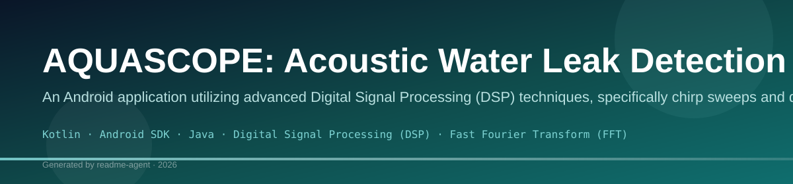
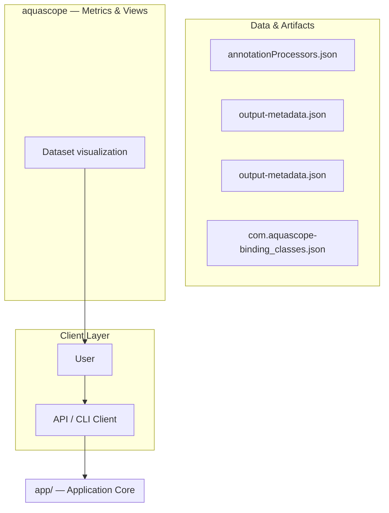
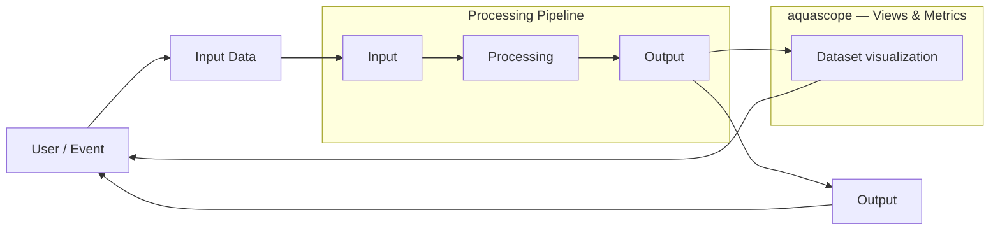
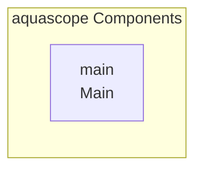

# AQUASCOPE: Acoustic Water Leak Detection System

An Android application utilizing advanced Digital Signal Processing (DSP) techniques, specifically chirp sweeps and deconvolution, to detect and quantify water leaks by analyzing acoustic resonance signatures.

## Overview

AQUASCOPE is a specialized mobile application designed for non-destructive acoustic leak detection in water pipes. It operates by generating a controlled acoustic signal (a chirp sweep) and recording the resulting resonance response. This recorded signal is then processed using Fast Fourier Transform (FFT) and deconvolution techniques to isolate characteristic acoustic features (like resonance frequency, decay rate, and amplitude) that indicate the presence and severity of a leak. The system maintains a baseline profile and scores new measurements against this baseline to determine anomaly levels.

## Problem

Detecting subtle water leaks in pipes requires specialized equipment. This application aims to provide an accessible, portable, and non-invasive method for early leak detection using standard smartphone microphones and speakers, translating complex acoustic physics into actionable, quantifiable data.

## Solution

The solution involves a multi-stage signal processing pipeline: 1) Generating a precise acoustic chirp sweep via the speaker. 2) Recording the pipe's natural resonance response via the microphone. 3) Applying DSP algorithms (FFT, Deconvolution) to the recorded signal. 4) Extracting key acoustic features (e.g., resonance frequency, decay time). 5) Comparing these features against a stored 'normal' baseline to generate a quantifiable anomaly score.

## Key Features

- Acoustic Chirp Sweep Generation: Generates a controlled frequency sweep signal for consistent testing.
- Real-time Audio Recording: Captures the acoustic response from the environment using the device microphone.
- Digital Signal Processing (DSP): Implements FFT and Deconvolution to isolate leak-related frequencies.
- Feature Extraction: Quantifies acoustic characteristics such as resonance frequency, decay rate, and amplitude.
- Baseline Management: Allows users to establish a 'normal' acoustic profile for a specific pipe section.
- Anomaly Scoring: Calculates a quantifiable score comparing current measurements against the established baseline to indicate leak severity.

## Technology Stack

- Kotlin
- Android SDK
- Java
- Digital Signal Processing (DSP)
- Fast Fourier Transform (FFT)

# AQUASCOPE — Acoustic Water Leak Detection

An Android app that turns your phone into a vibro-acoustic wall/pipe diagnostic tool. Hold the phone flat against a surface, emit a chirp sweep, record the response, and detect moisture anomalies from changes in resonance, decay, and spectral properties.

## How It Works

1. **Chirp emission**: A logarithmic sine sweep (20 Hz – 15 kHz) plays through the speaker while held against the surface
2. **Recording**: The microphone captures the surface's vibro-acoustic response
3. **Deconvolution**: FFT-based spectral division recovers the surface's impulse response
4. **Feature extraction**: Resonance frequency, decay time, spectral centroid, spread, and flatness
5. **Anomaly scoring**: New scans are compared to a stored baseline using weighted Euclidean distance

## Project Structure

```
app/src/main/java/com/aquascope/
├── audio/          Chirp generation, playback + recording (AudioTrack/AudioRecord)
├── dsp/            Pure-Kotlin FFT, deconvolution, feature extraction
├── baseline/       Anomaly scoring with configurable thresholds
├── data/           JSON-based local persistence for locations & scan history
└── ui/             Scan screen, results, history, multi-point scanning
```

## Building & Running

1. Open in Android Studio (Hedgehog or newer)
2. Sync Gradle
3. Run on a physical device (emulator won't produce meaningful acoustic results)
4. Grant microphone permission when prompted

### Running Unit Tests

```bash
./gradlew test
```

The DSP pipeline is fully unit-testable with synthetic signals — no Android device needed.

## Physical Validation Test

This is the critical experiment to validate the approach before trusting real-world results.

### Materials
- A piece of drywall (or any wall section you can test)
- Water to wet one side
- Your Android phone

### Procedure

1. **Dry baseline**: Hold phone flat against the dry drywall. Run 3–5 scans and save each as baseline. This averages out noise.

2. **Wet the sample**: Soak one area of the drywall with water (behind the surface you'll scan, simulating a hidden pipe leak). Wait 5–10 minutes for absorption.

3. **Wet scan**: Hold phone against the wet area. Run a scan and compare to baseline.

4. **Expected results**:
   - Resonance frequency should **decrease** (water adds mass → lower natural frequency)
   - Decay time should **decrease** (water increases damping)
   - Anomaly score should be **significantly higher** than dry-vs-dry variance

5. **If the score is too low**: Adjust `FEATURE_SCALES` and `FEATURE_WEIGHTS` in `AnomalyScorer.kt`, and the sigmoid parameters in `distanceToPercent()`.

6. **If the score is too high for dry-vs-dry**: Increase `FEATURE_SCALES` to be more tolerant of normal variation, or increase the sigmoid `midpoint`.

### Key files to tune
- `baseline/AnomalyScorer.kt` — weights, scales, sigmoid parameters (all marked with TODO)
- `baseline/AnomalyScorer.kt` → `AnomalyThresholds` — green/yellow/red cutoffs
- `dsp/Deconvolution.kt` — regularization epsilon
- `audio/ChirpGenerator.kt` — frequency range, duration

## Technical Notes

- **FFT**: Pure-Kotlin radix-2 Cooley-Tukey implementation. No JNI/native needed — signal sizes are small (~64k–128k samples).
- **Audio effects disabled**: AcousticEchoCanceler, NoiseSuppressor, and AutomaticGainControl are explicitly disabled to preserve the raw signal.
- **AudioSource.UNPROCESSED**: Used when available for the rawest possible microphone input.
- **minSdk 26**: Supports Android 8.0+ (covers 95%+ of active devices).
# AquaScope

## Setup Guide

_Setup commands could not be extracted from the repository._

## System Architecture

High-level system design, data flows, API map, and workflow pipelines derived from the repository structure.

### System Architecture



### Data Flow & Charts Pipeline



### Component & API Map


