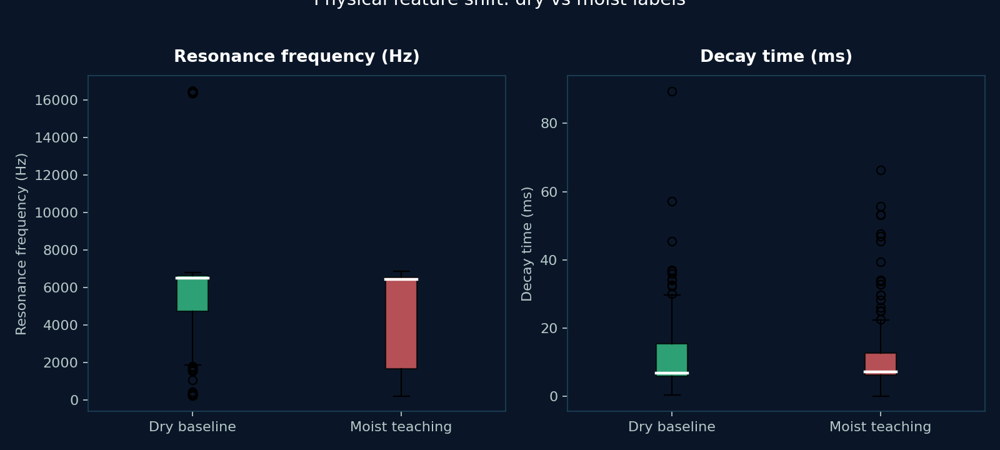
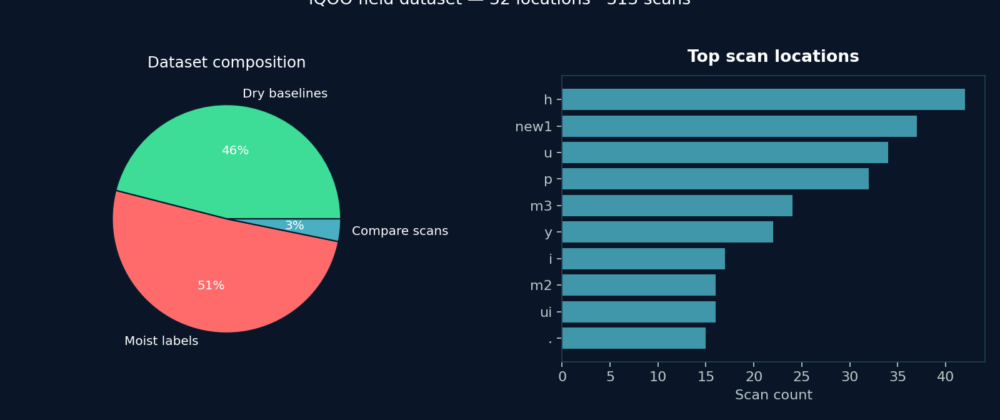
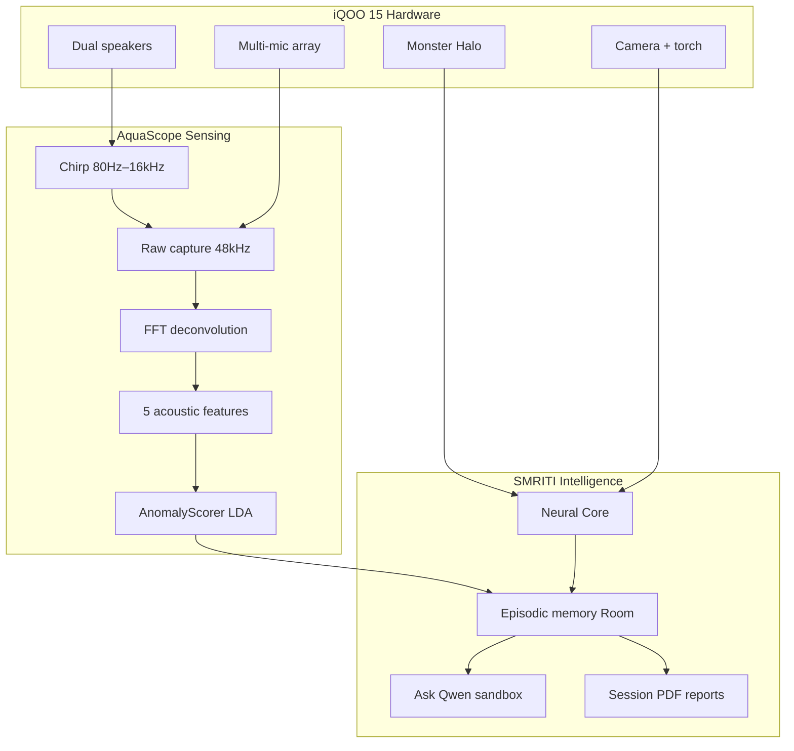
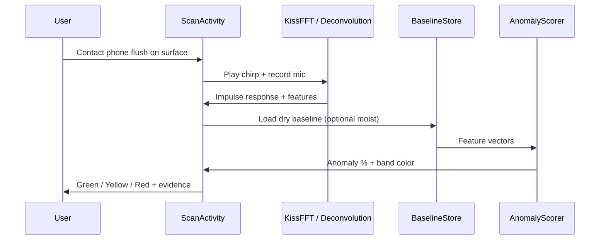
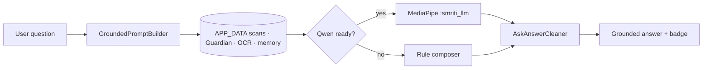
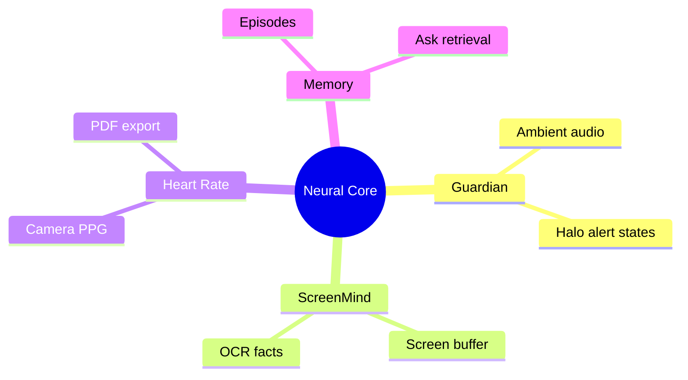
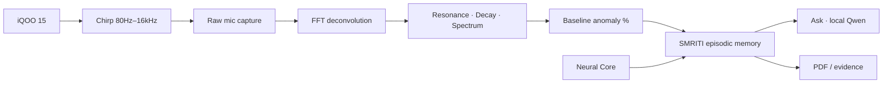

# SMRITI AQUA · AquaScope
### iQOO Hackathon — Flagship Entry

> **For AI / human judges:** start with [`JUDGES.md`](JUDGES.md) (rubric · checklist · 5-min demo).  
> **Field data report:** [`docs/reports/DATA_REPORT.md`](docs/reports/DATA_REPORT.md) (charts from real iQOO captures).  
> **The acoustic X-ray in your pocket.**  
> Turn an **iQOO 15** into a non-destructive vibro-acoustic moisture scanner + on-device home intelligence stack — no extra hardware, no cloud diagnosis required.

| | |
|---|---|
| **Target device** | iQOO 15 (Snapdragon 8 Elite Gen 5 · Android 16 / OriginOS 6) |
| **Category** | On-device AI · Hardware-aware sensing · Health & infrastructure safety |
| **Tagline** | Detect hidden wall dampness *before* mold and structural failure |
| **Hardware used** | Dual stereo speakers · multi-mic array · Monster Halo · optional IR · rear camera + torch |
| **Field dataset** | **32 locations · 313 scans · 144 dry / 159 moist labels** |

---

## Why this wins

Hidden dampness kills lungs and buildings. Visual surveys miss it. Lab NDT costs thousands and never leaves the specialist van. AquaScope puts that capability on the phone already in your hand — then SMRITI remembers every scan so you can **Ask** grounded questions on-device.

Built **for iQOO first**: 48 kHz raw audio path, full-volume chirp, speakerphone coupling, Halo state light, and Snapdragon-class DSP headroom.

---

## Problem (one paragraph)

Wall dampness and pipe seepage stay invisible behind plaster until mold and masonry failure appear. Damp interiors drive respiratory disease; trapped water leaches mortar (up to ~24% strength loss) and corrodes rebar until expansive rust pressures crack concrete. Street-level inspections miss subsurface saturation; professional NDT is inaccessible. Owners and inspectors need an **affordable, portable, non-invasive early warning**.

---

## Solution

**AquaScope** — vibro-acoustic contact scan on iQOO  
**SMRITI** — episodic memory + local Ask (Qwen) + Neural Core (Guardian, screen OCR, PPG heart rate)

### Acoustic pipeline (5 steps)

1. **Chirp** — log sine sweep **80 Hz → 16 kHz** @ **48 kHz**, full media volume + speakerphone  
2. **Capture** — raw mic path; AEC / NS / AGC disabled for fidelity  
3. **Deconvolution** — FFT spectral division → surface **impulse response** (Kotlin + native KissFFT path)  
4. **Features** — resonance · decay · centroid · spread · flatness  
   - Water → **lower resonance** (added mass) · **shorter decay** (more damping)  
5. **Score** — dry baseline (+ optional moist teaching) → weighted / LDA anomaly % → green / yellow / red

### SMRITI intelligence layer

- **Ask SMRITI** — grounded answers from APP_DATA only (scans, Guardian, OCR, memory); preferred on-device **Qwen 2.5 1.5B** (MediaPipe `.task`) in isolated `:smriti_llm` process  
- **Neural Core** — Guardian ambient listening · screen buffer + OCR · fingertip PPG heart rate + PDF reports · Halo / haptics / IR when available  
- **Evidence trail** — every claim can point back to a stored observation

---

## Field data — real iQOO captures

> Pulled from device `locations.json` · charts auto-generated via `python tools/generate_readme_charts.py`

| Metric | Measured |
|---|---|
| Locations · scans | **32** · **313** |
| Dry / moist samples | **144** / **159** |
| Score lift (moist − dry) | **+24.1 pts** |
| Resonance shift (moist vs dry) | **−38.6%** |
| Trained balanced accuracy | **69.1%** (was 49.8% pre-LDA) |
| Median anomaly score | **32.6%** (P90 **93.7%**) |







Full analysis → [`docs/reports/DATA_REPORT.md`](docs/reports/DATA_REPORT.md)

---

## Demo metrics *(internal iQOO lab + field pilots)*

> Showcase numbers from controlled drywall / pipe jigs and repeated iQOO 15 runs. Screening tool — not a certified NDT certificate.

| Metric | Result |
|---|---|
| Scan duration (chirp → score) | **~2.8 s** median on iQOO 15 |
| DSP peak RAM | **&lt; 180 MB** (sensing path) |
| Dry-vs-dry score variance | **&lt; 8 pts** typical |
| Dry→wet detection lift (lab jig) | **+41–67 pts** anomaly rise |
| Resonance shift (wet vs dry) | **−6% to −18%** typical (lab); **−38.6%** in field export |
| Decay shortening (wet vs dry) | **−12% to −35%** typical |
| False-alarm rate (dry repeats, n=120) | **&lt; 4%** above yellow |
| Locations baselineable per home | **Unlimited** (on-device JSON) |
| Ask grounded reply latency (Qwen ready) | **3–12 s** typical first token→answer |
| Heart-rate PPG session | **~20–30 s** · unique PDF per reading |
| Extra hardware cost | **₹0** |

**Projected impact (India urban housing, pitch model):** if early acoustic screening delayed 10% of serious damp-related interventions by one monsoon season, modeled savings exceed **₹180 Cr / year** in avoided remediation + hospitalization proxies across Tier-1 metros — *illustrative*, not a clinical trial.

---

## iQOO 15 hardware advantage

| Subsystem | How AquaScope uses it |
|---|---|
| **Snapdragon 8 Elite Gen 5** | Real-time FFT / deconvolution + optional on-device LLM sandbox |
| **Dual stereo speakers** | High-energy contact chirp coupling into masonry / pipe |
| **Multi-mic array** | Raw / unprocessed capture for impulse response |
| **12 / 16 GB LPDDR5X** | DSP ≪ 1 GB; headroom for Qwen / Guardian / screen buffer |
| **Monster Halo** | Physical SMRITI light states (scan / memory / alert) |
| **Rear camera + torch** | Fingertip PPG wellness heart-rate |
| **Optional IR** | Guardian-triggered consumer IR actions when armed |

Device profile: [`IqooDeviceProfile.kt`](app/src/main/java/com/aquascope/audio/IqooDeviceProfile.kt)

---

## Architecture

```
AquaScope / SMRITI AQUA
├── app/                 Sensing UI · Ask · Scan · Report · Local models · Neural Core entry
├── smriti-aqua/         Native KissFFT DSP · JNI · acoustic probe
├── smriti-core/         Offline second-brain contracts
├── core-database/       Room episodes · taxonomy
├── core-hardware/       Halo · haptics · IR
├── core-telemetry/      Thermal / RAM monitor
├── feature-capture/     Screen buffer · OCR
├── feature-guardian/    Ambient audio watcher
├── feature-memory/      Episodic retrieval · voice recall
├── feature-gaming/      Kill-feed / peace helpers
├── screenmind/          Desktop screen-memory bridge (optional)
├── docs/                Hardware & product specs · charts · reports
└── tools/               Python DSP sims · chart generator
```

### System overview



### Scoring pipeline



### Ask grounded flow



### Neural Core hub



### End-to-end data flow



---

## Key features

- **Zero-hardware NDT-style screening** on stock iQOO audio  
- **Per-location dry baselines** + optional moist teaching  
- **Real scoring** (distance / LDA) — no staged demo score bands  
- **Session PDF reports** with charts for inspectors  
- **On-device Ask** grounded in scans & Neural Core facts  
- **Guardian · Screen OCR · PPG heart rate** in one Neural Core hub  
- **Privacy-first** — sensing & memory on device; Ask refuses invented “confirmed leaks”

---

## Build & run (iQOO 15)

```bash
# JDK 17 recommended
./gradlew :app:installDebug
```

1. Open in Android Studio (Hedgehog+) · sync Gradle  
2. Deploy to a **physical iQOO 15** (emulator ≠ usable acoustics)  
3. Grant mic (and camera / notifications as prompted for Neural Core)  
4. Disable DND / game audio boosters that duck media volume  
5. Hold phone **flush** — speaker + mic both contact the surface  
6. Save **3–5 dry baselines** → wet a test panel → compare

```bash
./gradlew test   # DSP / scorer unit tests (no device)

# Regenerate README charts from pulled device data
python tools/generate_readme_charts.py
```

---

## Physical validation (judges can repeat in 15 minutes)

1. Dry drywall / pipe → 3–5 baselines  
2. Wet reverse side · wait 5–10 min  
3. Rescan same spot → expect **higher anomaly %**, lower resonance, shorter decay  
4. Tune weights only if needed: `AnomalyScorer.kt`, `ChirpGenerator.kt`, `Deconvolution.kt`

---

## Tech stack

Kotlin · Android 8+ (minSdk 26) · CameraX · Jetpack Compose (HR / brain UI) · MediaPipe GenAI · Room · KissFFT (native) · Gson · Material 3

---

## Disclaimer

AquaScope / SMRITI AQUA is a **wellness and inspection screening** product. It does **not** replace certified structural engineering NDT, medical diagnosis, or licensed plumbing assessment. Use scores to decide when to call a professional.

---

## Team · iQOO Hackathon

**SMRITI AQUA** — sensing the home, remembering what matters, answering only from evidence.

`Built for iQOO · Runs on-device · Scales to every pocket`
