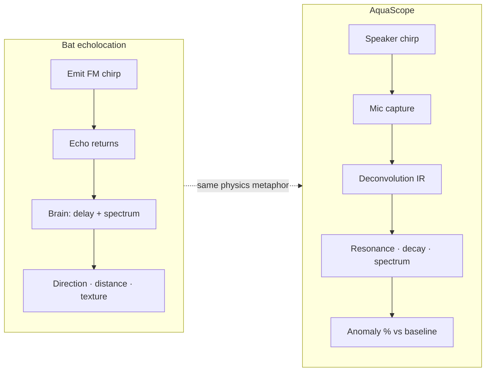
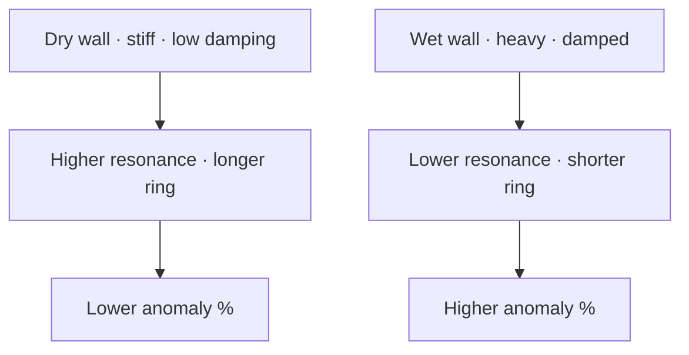
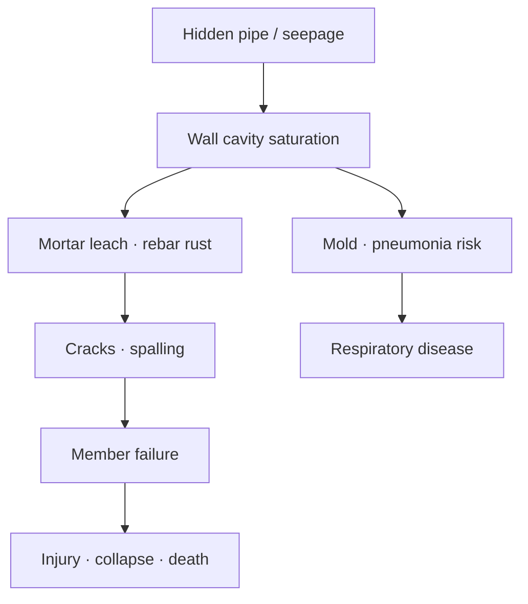
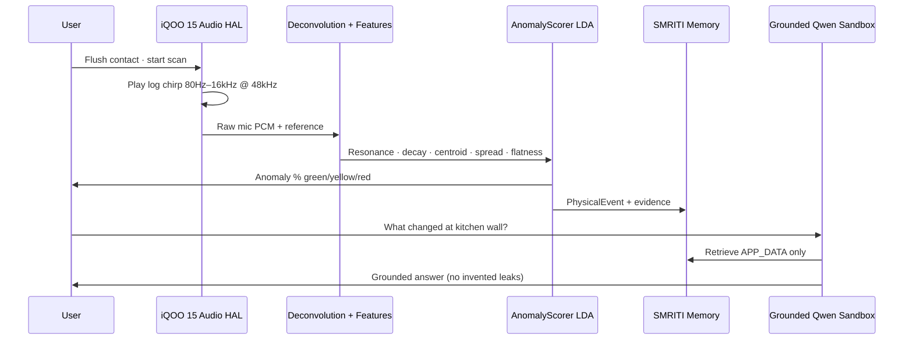
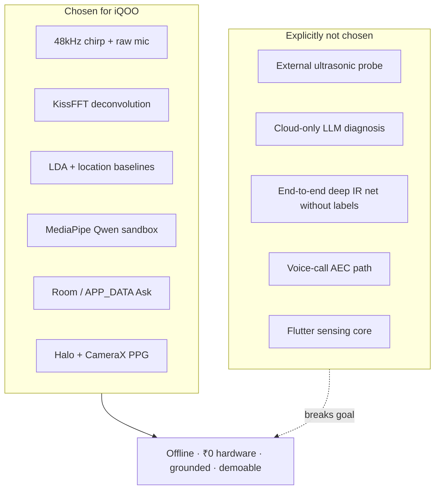

# TECHNICAL_DEPTH.md — Science · Risk · Use Cases · iQOO Tech Stack

> **For judges & technical reviewers:** deep dive into *why* AquaScope / SMRITI AQUA works, *what* is at stake, and *why* each stack choice fits **iQOO 15**.  
> **Companion docs:** [`NOVELTY.md`](NOVELTY.md) · [`JUDGES.md`](JUDGES.md) · [`docs/reports/DATA_REPORT.md`](docs/reports/DATA_REPORT.md)

---

## 1. Inspired by bats — echolocation as the design metaphor

Bats do not “see” walls with light. They **emit a frequency-swept cry (chirp)**, listen to the **echo**, and decode **distance, direction, and material** from timing and spectral change.

| Bat biology | AquaScope on iQOO 15 |
|---|---|
| Ultrasonic chirp / FM sweep | Log sine sweep **80 Hz → 16 kHz** @ **48 kHz** (phone-usable band) |
| Ears receive echo | Multi-mic array, raw / unprocessed path |
| Brain maps delay + spectrum → “object” | FFT **deconvolution** → impulse response → 5 acoustic features |
| Directional hunting / obstacle avoidance | Contact scan at a **named location** (kitchen pipe, damp wall, cylinder) |
| Soft vs hard prey / clutter discrimination | Dry baseline vs moist / degraded teaching labels |

### Important accuracy note

True bat calls often sit **above 20 kHz**. Phone speakers and mics are weak there. AquaScope deliberately uses the **audible → near-ultrasonic band the iQOO can actually drive and record** (80 Hz–16 kHz), while keeping the **same information strategy**: *send a known sweep, recover the object’s impulse response, compare to memory.*

That is **vibro-acoustic contact sensing inspired by echolocation**, not a medical ultrasound probe.

---

## 2. How water in a wall changes the “echo”

When water saturates plaster, mortar, or timber:

1. **Added mass** → natural resonance frequency **falls**  
2. **Extra damping** → vibration energy dies faster → **shorter decay**  
3. **Scattering / absorption** → spectral centroid, spread, and flatness shift  

AquaScope recovers the surface **impulse response** \(H(t)\) via Wiener-style spectral division:

\[
H(f) = \frac{Y(f)\,X^*(f)}{|X(f)|^2 + \varepsilon^2}
\]

where \(X\) is the known chirp and \(Y\) is the mic recording. Features extracted from \(H(t)\) are scored against a **dry baseline** (and optional moist teaching) → green / yellow / red.

**Field export (iQOO 15):** moist vs dry showed **≈ −38.6% resonance shift** and **+24.1 pt** score lift after LDA training — see [`docs/charts/`](docs/charts/).

---

## 3. Why damp walls kill — health cascade

Hidden moisture is not a cosmetic stain. It is a **biological reactor** behind plaster.

### Pathogen & toxin pathway

| Stage | What happens | Human impact |
|---|---|---|
| 1. Persistent damp | Relative humidity rises in cavities | Ideal for mold / bacteria |
| 2. Mold colonization | *Aspergillus*, *Penicillium*, *Cladosporium*, *Stachybotrys* (toxic black mold) grow on gypsum, wallpaper, timber | Spores + mycotoxins aerosolize |
| 3. Indoor air pollution | Spores, VOCs, bacterial endotoxins enter breathing zone | Especially bedrooms / kitchens with poor ventilation |
| 4. Respiratory injury | Chronic inflammation of airways | Asthma exacerbation, allergic rhinitis, bronchitis |
| 5. Severe outcomes | Immunocompromised, infants, elderly | **Pneumonia**, hypersensitivity pneumonitis, invasive aspergillosis risk |
| 6. Long-term | Repeated infections + damp homes | Higher COPD / chronic lung disease burden in dense urban housing |

**Why early acoustic screening matters:** mold often blooms **before** paint blistering is obvious. Visual surveys miss subsurface saturation; AquaScope aims to flag anomaly **before** the biological load explodes.

> Screening tool only — not a clinical diagnosis of pneumonia or mold species ID. Use high anomaly scores to call a professional inspector / doctor.

### Social stakes (India urban housing)

Monsoon seepage, leaking roofs, and concealed pipe joints turn apartments into year-round damp chambers. Respiratory disease remains a leading cause of disability-adjusted life years in crowded cities. An **₹0-extra-hardware** early warning on the phone already in the home is the design bet.

---

## 4. Why damp walls collapse — structural cascade

Water does not only grow mold. It **chemically and mechanically destroys load paths**.

| Mechanism | Physics / chemistry | Failure mode |
|---|---|---|
| Mortar leaching | Dissolves calcium compounds; strength loss reported up to ~**24%** in prolonged saturation studies | Masonry softens; joints crush |
| Rebar corrosion | Chlorides + moisture → rust | Rust expands (~2–6× volume) → cracks concrete cover |
| Timber rot | Fungi digest cellulose in wet wood | Beams / joists lose section modulus |
| Soil / foundation washout | Persistent leaks erode fill | Differential settlement, crack propagation |
| Progressive collapse | Local member failure redistributes load | Partial or full building failure → **injury / death** |

AquaScope does **not** certify structural safety. It provides a **portable NDT-style early signal** so owners call engineers **before** rust jacking and timber rot become irreversible.

---

## 5. Use cases — same physics, many targets

The bat metaphor generalizes: **any object whose stiffness / mass / damping changes** can shift the impulse response.

### 5.1 Hidden wall & pipe dampness (primary)

- Kitchen / bathroom walls behind tiles  
- Ceiling seepage after monsoon  
- Concealed GI / PVC pipe joints  
- Basement retaining walls  

**Workflow:** 3–5 dry baselines → rescan after wet event → rising anomaly % + falling resonance.

### 5.2 Sandalwood & heritage timber degradation

Sandalwood and carved timber degrade when **moisture + fungi** soften the cellular matrix:

- Resonance drops as effective stiffness falls  
- Decay shortens as damping rises  
- Useful for **museum / temple / heritage conservation** screening without drilling cores  

**Why phone sensing helps:** non-destructive contact scan on accessible faces; serial baselines over months detect progressive softening before visual collapse of carving detail.

### 5.3 LPG / gas cylinders & metal vessels (safety screening)

Cylinders and tanks change vibro-acoustic signature when:

| Condition | Expected acoustic shift |
|---|---|
| Liquid fill level / mass change | Resonance and damping shift |
| Wall thinning / corrosion | Softer response, altered decay |
| Dent / buckle / impact damage | Spectral scatter / flatness change |
| Loose base / unstable seating | Coupling artifact + repeat-scan variance |

**Safety note:** AquaScope is **not** a certified gas leak detector or PESO inspection tool. It can be a **household screening adjunct**: baseline a healthy cylinder surface, flag large acoustic changes, then follow official refill / inspection protocols. Never replace soap-bubble / electronic gas detectors for LPG leak checking.

### 5.4 Additional high-value screens

| Use case | What changes | Why it matters |
|---|---|---|
| Wooden furniture / doors | Moisture swell / rot | Indoor air + structural furniture failure |
| Drywall vs wet drywall panels | Mass + damping | Pre-renovation survey |
| Ceramic / tile hollowness | Debond → air gap resonance | Tile drum detection without hammer tap alone |
| Water tanks (plastic / metal) | Level & wall integrity | Overflow / crack early warning |
| Ship / boat hull panels (consumer) | Water ingress in composites | Small craft DIY screening |
| Acoustic fingerprint of a “known good” home zone | Drift over weeks | Insurance / landlord inspection trail |

All use cases share one stack: **chirp → deconvolution → features → location baseline → anomaly % → SMRITI memory → Ask**.

---

## 6. End-to-end technical pipeline (depth)

| Stage | Technique | Why this technique |
|---|---|---|
| Excitation | Log chirp | Constant energy per octave; better SNR than impulse click on weak phone speakers |
| Capture | Raw mic, AEC/NS/AGC off | Voice FX destroy impulse response fidelity |
| Recovery | Wiener deconvolution | Stable \(H(f)\) when speaker response has nulls |
| Features | Resonance, decay, 3 spectral stats | Map directly to mass / damping / scatter physics |
| Score | Weighted distance + optional 1-D LDA | Works with few samples; moist teaching when available |
| Memory | Episodic events + evidence states | Makes scores queryable over time |
| Ask | Isolated MediaPipe Qwen | On-device, grounded, crash-isolated |

---

## 7. Tech stack — what we use, why, and why not the alternatives (iQOO-first)

Target: **iQOO 15** — Snapdragon 8 Elite Gen 5 · dual stereo speakers · multi-mic · 12/16 GB LPDDR5X · Monster Halo · rear camera + torch · Android 16 / OriginOS 6.

### 7.1 Sensing & DSP

| Choice | Why on iQOO | Rejected alternatives | Why rejected |
|---|---|---|---|
| **48 kHz preferred sample rate** | Matches Hi-Res / Snapdragon audio path; Nyquist ≫ 16 kHz chirp end | 8 / 16 kHz voice rates | Aliases / loses high-band energy needed for spectral features |
| **Log chirp 80 Hz–16 kHz** | Fits phone speaker power curve; >20 kHz ultrasonic is barely audible to the phone | True 40 kHz ultrasonic transducers | Requires external piezo; breaks “₹0 hardware” |
| **Speakerphone + bottom-speaker stereo routing** | Couples energy into masonry / pipe on contact | Earpiece-only / media quiet path | Too little acoustic power for structure-borne response |
| **AEC / NS / AGC disabled + UNPROCESSED mic** | Preserves raw IR | Default voice-call processing | Cancels / compresses the chirp echo we need |
| **Wiener FFT deconvolution (Kotlin + KissFFT native path)** | Deterministic, unit-testable, low RAM | ML end-to-end spectrogram CNN only | Needs huge labeled sets; opaque to inspectors; harder offline |
| **KissFFT (native, BSD)** | Tiny, portable, Snapdragon-friendly | FFTW / heavy DSP libs | License / size / NDK complexity without gain for ~64k–128k FFTs |
| **5 handcrafted features + LDA** | Interpretable; trains from 100s of on-device labels | Cloud deep models | Latency, privacy, offline failure, hallucination risk on “leak confirmed” |

### 7.2 Application & UI

| Choice | Why | Rejected | Why not |
|---|---|---|---|
| **Kotlin + Android SDK (minSdk 26)** | First-class on OriginOS / iQOO; Coroutines for scan I/O | Flutter / React Native for sensing core | Extra audio bridge latency; harder raw AudioTrack / AudioRecord control |
| **Jetpack Compose (Neural Core / HR)** | Fast iteration for PPG UI + waveforms | Pure XML everywhere | Compose better for animated wellness UI; XML kept for Ask / Scan where already stable |
| **Material 3** | System theming on Android 16 | Custom heavy UI kit | Maintenance cost; no sensing benefit |
| **CameraX + torch** | Stable PPG capture on flagship cameras | Raw Camera2 only | CameraX lifecycle safety on multi-cam iQOO |

### 7.3 On-device intelligence & memory

| Choice | Why | Rejected | Why not |
|---|---|---|---|
| **MediaPipe Tasks GenAI (Qwen 2.5 1.5B `.task`)** | Runs on Snapdragon NPU/CPU class devices; offline Ask | Cloud GPT for every question | Privacy; needs net; invents medical/leak claims |
| **Isolated `:smriti_llm` process** | Native LLM crash ≠ kill sensing UI | In-process MediaPipe only | One OOM/crash takes down scan app |
| **Grounded prompts + rule composer fallback** | Always answerable even if model missing | LLM-only architecture | Demo fragility on fresh installs |
| **Room + episodic JSON stores** | Local, queryable, audit-friendly | Firebase-only memory | Cloud dependency; poor offline monsoon scenarios |
| **ML Kit text recognition (Latin + Devanagari)** | On-device OCR for ScreenMind facts | Cloud Vision OCR | Latency + privacy |
| **TFLite (where used)** | Edge inference without network | Server inference | Breaks offline guardian / screen paths |

### 7.4 Hardware UX unique to iQOO

| Choice | Why | Rejected | Why not |
|---|---|---|---|
| **Monster Halo light states** | Physical “bat sense” feedback without looking at screen | Screen-only toasts | Missed during flush contact scans |
| **Haptics + optional IR hooks** | Confirm scan / Guardian arm | Pure silent background | Weak demo + weak accessibility |
| **IqooDeviceProfile locking chirp/SR** | Reproducible demos on hackathon device | One-size-fits-all audio defaults | Mid-range phones duck volume / alter EQ |

### 7.5 Reporting & science tooling

| Choice | Why | Rejected | Why not |
|---|---|---|---|
| **On-device PDF session reports** | Inspector-ready offline | Email-only cloud dashboards | Field sites lack reliable net |
| **Python chart / LDA training scripts** | Reproducible science from pulled `locations.json` | Manual Excel only | Not reproducible for judges |
| **Gson for weight / location JSON** | Simple, battle-tested | Heavy ORMs for assets | Overkill for trained_weights.json |

### 7.6 Stack decision summary (one diagram)

---

## 8. Why iQOO 15 specifically unlocks this depth

| iQOO 15 asset | Technical role |
|---|---|
| Snapdragon 8 Elite Gen 5 | Real-time FFT + optional on-device LLM headroom |
| Dual stereo speakers | Enough contact energy for masonry / cylinder coupling |
| Multi-mic array | Spatial SNR for impulse recovery |
| 12 / 16 GB RAM | DSP ≪ 1 GB; Qwen + Guardian + OCR coexist |
| Monster Halo | Non-visual state channel during flush scans |
| Rear camera + torch | PPG wellness path in same Neural Core |
| OriginOS audio HAL | Prefer 48 kHz; disable processing for science fidelity |

Without these, true “pocket NDT + grounded home AI” collapses into either **external hardware** or **cloud dependency** — both rejected for this hackathon product.

---

## 9. Limitations (technical honesty)

- Phone band ≠ medical ultrasound; resolution is **screening**, not mm crack imaging.  
- Operator contact pressure and surface coupling dominate variance — teach per location.  
- LPG / sandalwood / structural claims are **anomaly relative to baseline**, not certified lab assays.  
- Respiratory and collapse narratives explain **why early detection matters**; the app does not diagnose pneumonia or predict collapse probability.  
- Field balanced accuracy ~**69%** after LDA — useful separation, not perfect.

---

## 10. Judge takeaway

**Technical depth** here is not “we used an FFT.” It is:

1. **Bat-inspired echolocation principles** adapted to phone physics.  
2. **Causal risk chain** from hidden water → mold/pneumonia and mortar/rebar failure → death.  
3. **Multi-domain use cases** (walls, sandalwood, LPG vessels, timber, tile) on one pipeline.  
4. **iQOO-constrained stack choices** that refuse cloud diagnosis, external ultrasonics, and voice-FX audio paths so the science stays on-device and reproducible.

**SMRITI AQUA** — *echo like a bat, remember like a home, refuse to invent the danger.*
