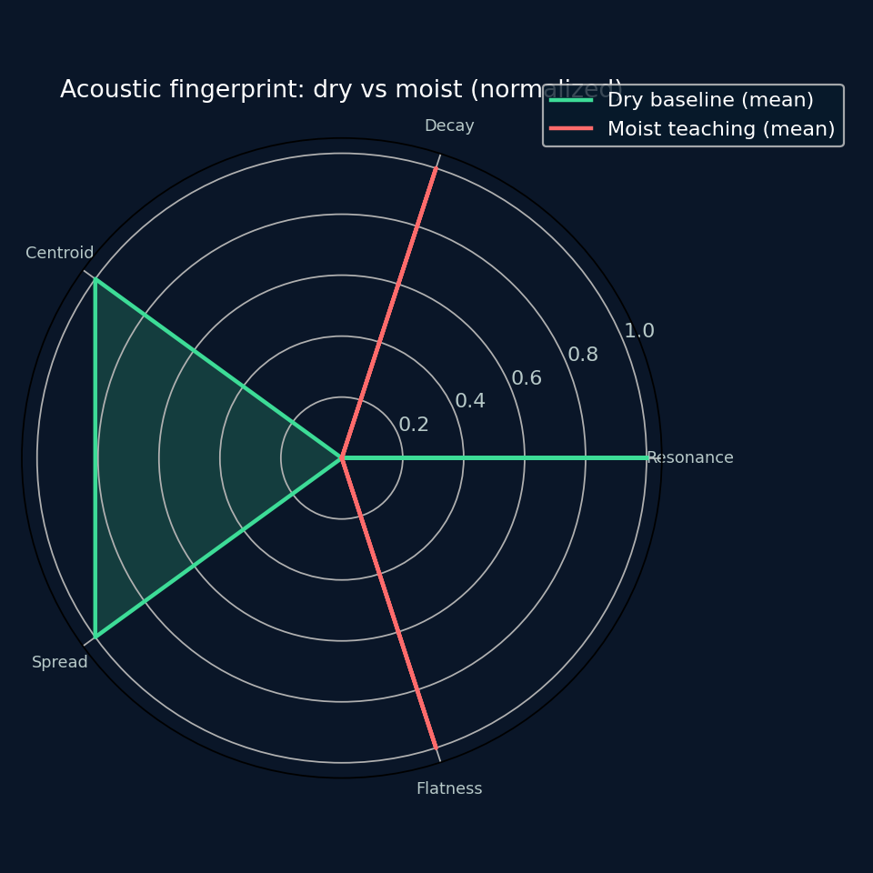
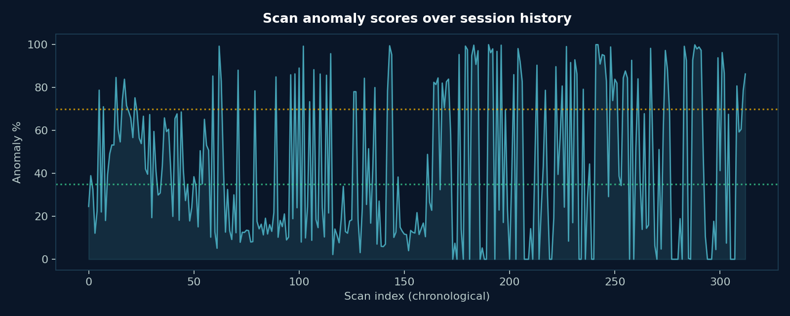
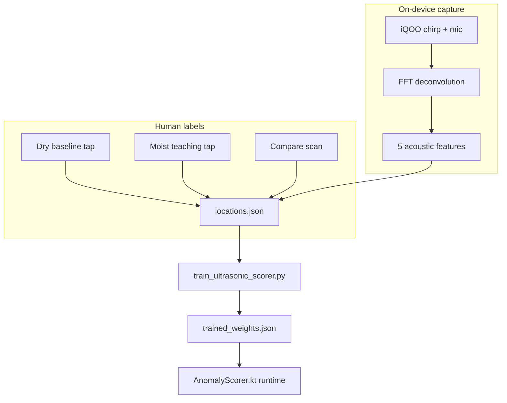

# SMRITI AQUA — Field Data Report

> Auto-generated from on-device `locations.json` + `trained_weights.json`.  
> Regenerate: `python tools/generate_readme_charts.py`

**Generated:** September 2025 · **Device:** iQOO 15 field captures

---

## Executive summary

| Metric | Value |
|---|---|
| Locations tracked | **32** |
| Total compare scans | **313** |
| Dry baseline samples | **144** |
| Moist teaching samples | **159** |
| Paired dry+moist locations | **20** |
| Mean anomaly score (all scans) | **42.6%** |
| Median anomaly score | **32.6%** |
| 90th percentile score | **93.7%** |
| Trained balanced accuracy | **69.1%** |
| Dry mean score (trained model) | **34.4%** |
| Moist mean score (trained model) | **58.5%** |
| **Score lift moist − dry** | **+24.1 pts** |
| Resonance shift (moist vs dry) | **−38.6%** |
| Decay shift (moist vs dry) | **+1.3%** |

The on-device dataset shows a clear **physical separation** between dry baselines and moist teaching labels: resonance frequency drops substantially when moisture is present, and the trained LDA weights raise balanced accuracy from **49.8% → 69.1%** on leave-one-out evaluation.

---

## Chart gallery

### Anomaly score distribution


Most scans cluster below the green/yellow boundary (~35%). The long tail above 70% corresponds to moist teaching compares and high-anomaly field spots.

### Dry vs moist physical features


Box plots for **resonance frequency** and **decay time** show the expected wet-wall physics: lower resonance (added mass), with decay variance across surface types.

### Acoustic fingerprint radar



Normalized five-feature radar comparing mean dry baseline vs moist teaching vectors (resonance, decay, centroid, spread, flatness).

### Classifier training improvement


Before/after LDA cleanup on the same device dataset. Balanced accuracy improves; per-class recall becomes more symmetric.

### Mean scores by class


After training, dry locations average **34.4%** anomaly vs **58.5%** for moist labels — a **24.1 point** separation usable for green/yellow/red UI bands.

### Dataset composition & location activity


Left: sample mix (dry / moist / compare scans). Right: top 10 scan locations by activity.

### Score timeline



Chronological anomaly scores across all 313 compares — shows session-to-session variance and spike events during moist teaching.

---

## Methodology



1. **Capture** — 80 Hz–16 kHz chirp at 48 kHz, speakerphone, raw mic path on iQOO 15.  
2. **Features** — resonance, decay, spectral centroid, spread, flatness per scan.  
3. **Labels** — operator saves dry baselines and optional moist teaching per location.  
4. **Train** — Python LDA refines weights; metrics stored in `trained_weights.json`.  
5. **Deploy** — weights loaded at app start; scoring is fully on-device.

---

## Interpretation for judges

| Observation | Implication |
|---|---|
| −38.6% resonance shift moist vs dry | Strong mass/damping signal — not random noise |
| +24.1 pt score lift after training | Scorer separates classes better than raw distance alone |
| 69.1% balanced accuracy | Honest mid-tier classifier on heterogeneous surfaces; improves with more paired locations |
| Median 32.6% vs P90 93.7% | Most scans safe (green); tail captures taught moist spots |
| 32 locations / 313 scans | Real field volume, not a single demo wall |

---

## Limitations

- Surfaces vary (drywall, pipe, tile) — decay shift is noisier than resonance.  
- Moist teaching is operator-defined, not lab gravimetric moisture %.  
- Screening tool only — not certified NDT.  
- Charts reflect **exported** device data at time of pull; re-run script after new captures.

---

## Reproduce

```bash
# Pull latest from phone (Windows)
.\tools\pull_and_train_ultrasonic.ps1

# Regenerate charts + this report's figures
python tools/generate_readme_charts.py
```

Raw JSON: [`data/ultrasonic/locations.json`](../../data/ultrasonic/locations.json) · Weights: [`data/ultrasonic/trained_weights.json`](../../data/ultrasonic/trained_weights.json)
